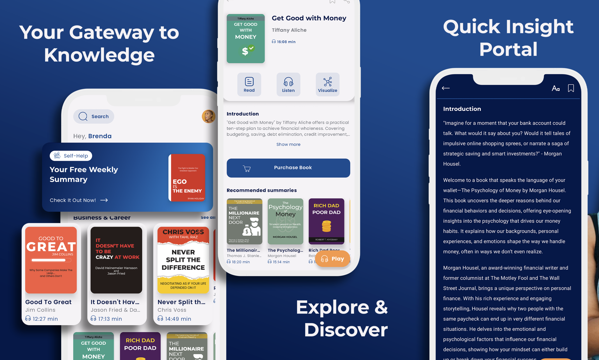
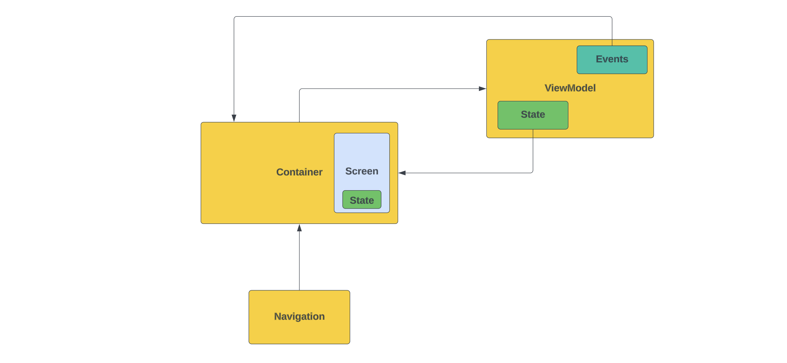
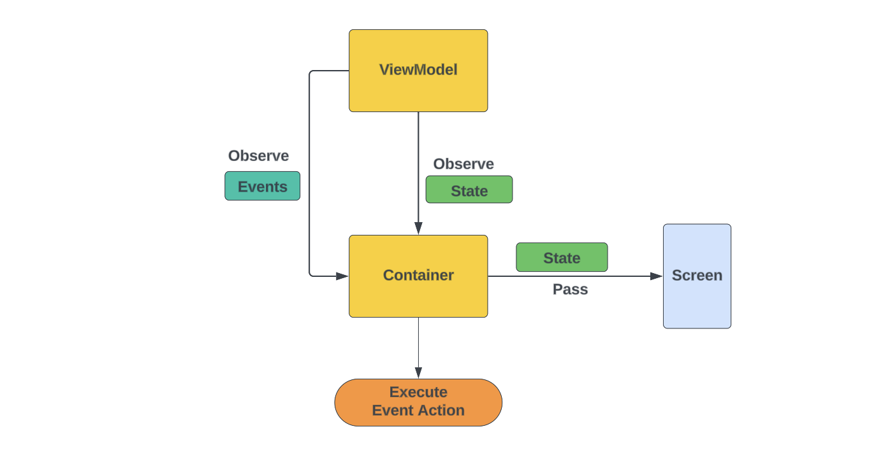
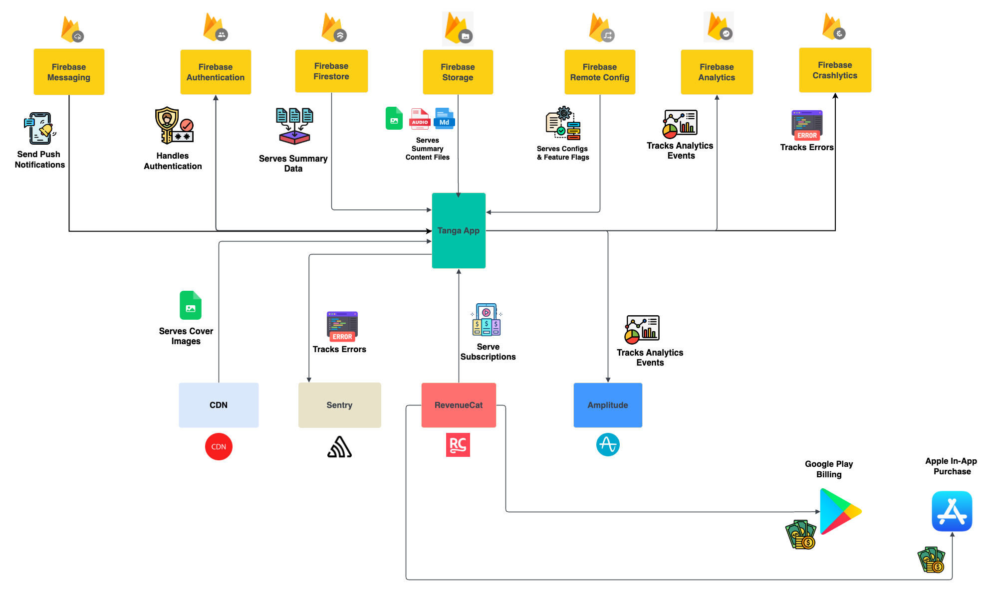

<h1 align="center">Tanga Mobile App</h1>

<p align="center">
  <a href="https://opensource.org/licenses/Apache-2.0"></a>
  <a href="https://android-arsenal.com/api?level=24"></a>
  <a href="https://github.com/rygelouv/Tanga/tree/dev"></a>
  <a href="https://sonarcloud.io/summary/new_code?id=rygelouv_Tanga"></a>
  <a href="https://codecov.io/gh/rygelouv/Tanga" > 
 </a>
</p>

---



---

<p align="center">
  <a href="https://opensource.org/licenses/Apache-2.0"></a>
  <a href="https://play.google.com/store/apps/details?id=app.books.tanga"></a>
  <a href="https://tanga.app/"></a>
</p>

---

## 🚧 **This project is still under construction** 🚧
You can come back in a few months to see considerable progress. In the meantime, here are our recent achievements (this list is not always up to date)

- [Enabled more user-centric features such as search, summaries by categories, etc](https://github.com/users/rygelouv/projects/3/views/1)
- [Enabled Anonymous Authentication capabilities](https://github.com/users/rygelouv/projects/9)
- [Added more unit tests and UI tests](https://github.com/users/rygelouv/projects/7)
- [Worked on our test coverage infrastructure](https://github.com/users/rygelouv/projects/6)
- [Worked on some performance investigation and improvements](https://github.com/users/rygelouv/projects/10)

The other projects can be found here:
- [Tanga Projects](https://github.com/rygelouv?tab=projects)

## Basic code organization

Feature code is located in the `feature` package. Each feature package follows a specific code organization. Each feature has the following components:

- Container
- Navigation
- Screen
- View Model
- UI Contract



### Containers

Each feature use a Container which role is to wrap the UI screen and make it independent of external and complex dependencies such as viewModels, navigation components etc.

This Allow us to have Screens that are pure Compose composables with their state properly hoisted (I think) not depending on any ViewModel or NavController. This means the Ui screens can easily be reused (say in Compose KMP for example) and Previews become easier to set up.

All of that is possible thanks to the concept of containers composables.
A Container does:

- Get an instance of a ViewModel
- Observe the ViewModel state and events
- Pass the UI state object to the Screen
- Handle UI Events for navigation actions
- Call actual viewModel functions that are wrapped as lambda before being passed down to the Screen



### Screens

As said in the Containers section. Screen must be free from viewModels and navigation as much as possible. Screens should simply receive the UI state and pass down the necessary state elements to its child composables. This is to ensure a proper state hoisting.

### Navigation files

Each feature should have its own navigation file that contains the code and logic on how we navigate to the feature. Navigation file essentially contain navigation composables or graphs that take to the Screen Containers

### UI Contract

Let’s make it straight, there is no component in Tanga called a “UI Contract”. This is simply the name of the file that holds the definition of **UI state** and **UI events** for a specific feature. This could have been in the ViewModel or somewhere else, but we have decided to put in a separate file called a UI Contract. By “Contract” you can understand the UI contract that binds the UI Screen to the ViewModel. Inspired from an old concept from the old MVP days.

### ViewModel

Well you know what a viewModel is. Let’s not waste time here.

### Architecture?

This project follows a typical/classic MVVM approach or whatever you may wanna call it if you think it’s not MVVM, tt doesn’t really matter. What is important here is that we use a ViewModel class that holds an observable state object.
State must be modeled in the form of a single object that represents all its variations. We use data class to model and represent state. It could have been sealed classes but that also doesn’t really matter, each approach has their pros and cons.

### Why isn’t the Repository also in the feature package

There is a misconception among Android engineers who tend to attach and couple a repository to a feature. They will build a UI screen, then it’s viewModel and then its repository and sometime even adding a useless UseCase in the middle.
A repository should NOT be coupled to a feature. A repository should be setup by Model and not by feature. For example: UserRepository manages data related to the User model, OrderRepository managers data related to Orders (CRUD and all other type of operations). HomeRepository or SearchRepository or ReadSummaryRepository are not valid repositories.
So a repository has nothing to do in a feature package. Plus, a repository should be reusable across multiple features. Even if you had UseCases, repositories and UseCase are not the same type of components in your architecture. You can have a UseCase for each feature but you should not have Repo for each feature.
And seriously, think twice before using UseCases though.

### Interactors?

UseCases are supposed to be components that help isolate business logic and eventually reuse them as well as allowing the testability of such logic. However UseCases in the Android community has become a form of weird architectural ~~pornography~~ fantasy.
We don’t use UseCases here. But we do think that sometimes a mobile app needs to run some business logic or may just need to “massage” some data from the repo/data source before passing it down to the ViewModel. That is where we bring Interactors in. They are components of business logic but:

- They are not always needed in every feature. Only when necessary and where they actually make sense.
- They don’t just stupidly contain a single line function that calls the Repo. They have multiple functions that serve multiple different operations and logic for the same feature.
- When they are present that means they actually do some real logic and not just delegating calls.
- Think of them as putting multiple (actual) UseCases together in a single class.

## Module Organization

Tanga project doesn’t have a module per feature breakdown as you’ll tend to see in many android sample projects that fantasize on modules. There is no plan of having a Module per feature breakdown because:

- Some features are very small why have a full feature module with everything that it implies (gradle, navigation trouble, communication with other modules etc…) for just a single screen?
- More feature modules means more challenges in terms of navigation, communication between those, DI etc. Is it really worth it?
- Breaking down in module should also depend on the team and the size of the project. Tanga is built by a single developer and is a relatively small project why bother with adding modularization complexity?

We only put in modules those parts we think actually make sense (tracking, ui system) and are not necessarily feature related. All the feature work sits in the app module.

### Core-ui module

This module contains our design system and all the core element needed to build our UI

**What’s wrong and/or what is missing?**

The design system is still very poor. Some components such as texts and some other buttons used in app module, should have been part of the design system in core-ui.

We need to find all UI components that must be moved to this module and move them.

### Tracking Module

Contains code for everything related to tracking.

- Analytics
- Errors
- Performances

**What’s wrong and/or what is missing?**

At the moment we are only tracking analytics so far. We need to decouple error tracking from `app` module and move it to `Tracking` module. We also need to add performance tracking and tracing in this module.
We may not need an abstraction for Analytics Providers though? Not sure 🤔

## Next steps on UI:
- Issues should be investigated and fixed: https://github.com/rygelouv/Tanga/issues

---

## Infrastructure 
Tanga relies almost entirely on Firebase for its infrastructure. We use Firebase for:
- Authentication
- Firestore Database
- Analytics
- Crashlytics Error Tracking
- Remote Config for feature flags
- Performance Monitoring
- Messaging for push notifications
- Storage for images and other files such as audio and graphics

We also use Sentry for extra error tracking and monitoring. We use RevenueCat for in-app purchases and subscriptions.



### Remaining Infrastructure automation work
- [x] Add a CI (Bitrise and Github Actions)
- [x] Add Ktlint
- [x] Add Detekt
- [x] Add SonarCloud
- [x] Add Codecove for test coverage tracking
- [x] Add error tracking system with Sentry and Crashlytics
- [ ] Add Detekt Step to CI
- [ ] Add full Android build on Github Action workflow

### Testing
We still don't have test yet in the app. This Test project will start after the infrastructure work is done or at least the most part of it.
- [x] Add JUnit 5
- [X] Add Mockk
- [x] Add Codecov for tracking project coverage
- [x] Add Kover and Jacoco for generating coverage reports
- [x] Start adding unit tests.
- [x] We need to UI test the screen composables
- [ ] Reach 50% coverage
- [ ] Add Screenshot tests
- [ ] Add Maestro tests

## Performances
- On debug build, the app is very slow on physical devices. This is need to be investigated. We started here: https://github.com/rygelouv/Tanga/pull/92
- [ ] Add macrobenchmark for Home screen
- [ ] Add baselie profiles if necessary
- [ ] Enable StrictMode to make sure no blocking work is done on the UI thread
- [ ] Track Memory leaks with Leak canary

# License
```xml
 Copyright 2023 Rygel Louv

    Licensed under the Apache License, Version 2.0 (the "License");
    you may not use this file except in compliance with the License.
    You may obtain a copy of the License at

    http://www.apache.org/licenses/LICENSE-2.0

    Unless required by applicable law or agreed to in writing, software
    distributed under the License is distributed on an "AS IS" BASIS,
    WITHOUT WARRANTIES OR CONDITIONS OF ANY KIND, either express or implied.
    See the License for the specific language governing permissions and
    limitations under the License.

```
